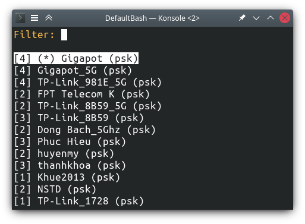
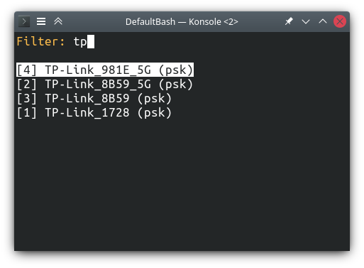

iwpick is a terminal user interface (TUI) for [iwd/iwctl][1] to help you
quickly pick and connect to a wifi network using only the keyboard.




I made this for my [GPD MicroPC][2], which has a very nice qwerty keyboard for
thumb typing but no touch screen.

# Install

```sh
go install go.imnhan.com/iwpick@latest
```

It makes a couple of assumptions:

- You have the `iwctl` executable in your $PATH and the necessary permission to
  run it. For Arch that means being in the appropriate usergroup(s).
- Your wireless device is `wlan0`. Otherwise, pull this repo, update the
  WIFI_DEVICE const and run `make` to recompile. Bonus points if you make it a
  [flag][3] and send me a pull request :^)

[1]: https://wiki.archlinux.org/title/iwd
[2]: https://twitter.com/nhanbt/status/1551734935471284226
[3]: https://pkg.go.dev/flag
